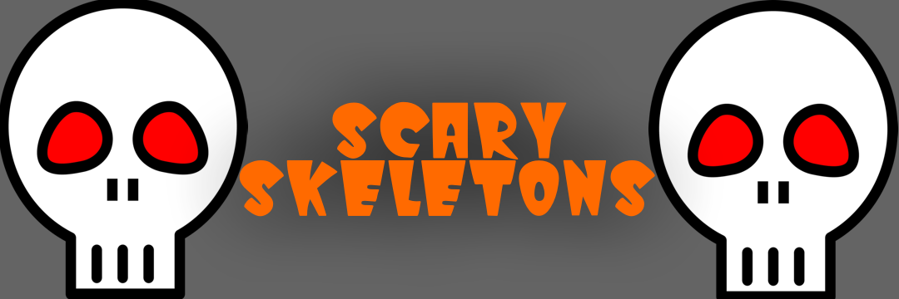

A simple VR wave shooter in Godot to demonstrate https://github.com/electronstudio/godot_vr_multi_template/

Supports:
* Oculus Rift
* Oculus Quest
* Steam VR
* Google Cardboard
* Flatscreen

You can play current flatscreen build here using Google Chrome: https://electronstudio.github.io/godot_vr_multi_template/

You can supply a numeric argument on the command line to specify your VR driver:
```
	AUTODETECT = 0
	FLATSCREEN = 1
	OCULUS_DESKTOP = 2
	OCULUS_MOBILE = 3
	CARDBOARD = 4
	OPENVR = 5
```

# Assets used

3d character models by http://quaternius.com/

https://www.patreon.com/quaternius

Graveyard models by https://kenney.nl

Blaster models by https://kenney.nl

Sci-fi sounds by https://kenney.nl

Photo by Lino Schmid https://commons.wikimedia.org/wiki/User:Capricorn4049#Credit
